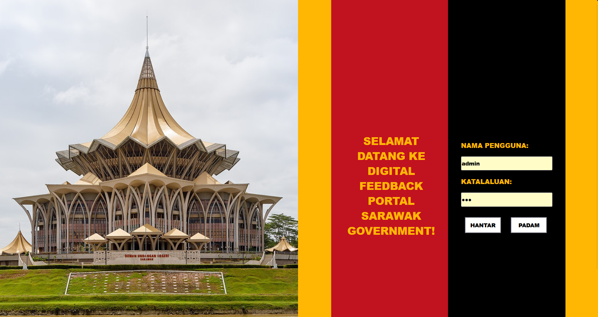

# Sarawak Digital Feedback Portal

A Java Servlet-based web application that enables Sarawak state residents to submit feedback about public services including infrastructure, healthcare, and education.

## Project Overview

This digital feedback portal improves transparency and citizen engagement by providing a secure platform for residents to submit complaints, suggestions, and inquiries to the Sarawak State Government.

## Features

- **Secure Authentication System** - Admin login with session management
- **Multi-language Support** - Internationalization using ResourceBundle (Bahasa Malaysia)
- **Form Validation** - Client-side and server-side input validation
- **Responsive Design** - Modern CSS styling with Sarawak state colors
- **Session Management** - Secure user sessions with proper validation
- **Feedback Categories** - Complaint, Suggestion, and Inquiry options

## Technology Stack

- **Backend**: Java Servlets (Jakarta EE)
- **Frontend**: JSP, HTML5, CSS3
- **Server**: Apache Tomcat
- **Architecture**: MVC (Model-View-Controller) Pattern

## Project Structure

```
my.gov.sarawak.feedback/
├── servlets/
│   ├── LoginServlet.java      # Handles authentication
│   └── FeedbackServlet.java   # Processes feedback submissions
├── views/
│   ├── LoginForm.jsp          # Admin login interface
│   └── FeedbackForm.jsp       # Citizen feedback form
├── resources/
│   └── Messages.properties    # Internationalization bundle
└── styles/
    ├── style.css              # Login page styling
    └── feedback.css           # Feedback form styling
```

## Key Implementation Details

### Servlet Architecture

**LoginServlet.java**
- `doGet()`: Displays login form with internationalization
- `doPost()`: Validates credentials and manages user sessions
- Session attributes: username, role, sessionSuccess, timestamp

**FeedbackServlet.java**
- `doGet()`: Serves feedback form (requires valid session)
- `doPost()`: Processes form submissions with validation
- Server-side validation for all input fields
- Success/error feedback via JavaScript alerts

### Security Features

- Session-based authentication
- Server-side input validation
- Proper parameter sanitization
- Session invalidation on failed login
- Protected routes requiring authentication

### HTTP Headers Implementation

All servlets implement proper HTTP headers:
```java
response.setHeader("Accept-Language", "ms-MY");
response.setContentType("text/html; charset=UTF-8");
response.setCharacterEncoding("UTF-8");
```

### Form Validation

**Client-side validation:**
- Required field validation using HTML5 attributes
- Email format validation

**Server-side validation:**
- Full name: Required, non-empty
- Email: Valid email format using regex pattern
- Description: Minimum 10 characters
- Error messages stored in request attributes

### Internationalization

Supports Bahasa Malaysia locale using ResourceBundle:
- Dynamic text loading from `Messages.properties`
- Locale-specific formatting
- Consistent language experience across all pages

## Installation & Setup

1. **Prerequisites**
   - Java 11 or higher
   - Apache Tomcat 9.0+
   - Eclipse IDE (or similar)

2. **Deployment**
   ```bash
   # Clone the repository
   git clone [repository-url]
   
   # Import into Eclipse as Dynamic Web Project
   # Deploy to Tomcat server
   # Access via: http://localhost:8080/[project-name]/LoginServlet
   ```

3. **Default Credentials**
   - Username: `admin`
   - Password: `123`

## Usage Flow

1. **Access Application**: Navigate to `/LoginServlet`
2. **Authentication**: Login with admin credentials
3. **Feedback Submission**: Complete the feedback form
4. **Validation**: System validates all inputs
5. **Confirmation**: Success/error message displayed

## Form Fields

- **Full Name**: Text input (required)
- **Email**: Email input with validation (required)
- **Feedback Type**: Dropdown selection
  - Complaint
  - Suggestion  
  - Inquiry
- **Description**: Textarea with minimum 10 characters (required)

## Design Features

- **Color Scheme**: Sarawak state colors (Red #c1121f, Yellow #ffb703)
- **Responsive Layout**: Flexbox-based design
- **Professional Styling**: Card-based interface with hover effects
- **Accessibility**: Proper contrast ratios and semantic markup

## Technical Specifications

- **Package Structure**: `my.gov.sarawak.feedback`
- **Servlet Mapping**: Annotation-based (`@WebServlet`)
- **Request Methods**: GET for display, POST for processing
- **Session Management**: `HttpSession` with timeout handling
- **Error Handling**: Comprehensive validation with user feedback

## Future Enhancements

- Database integration for persistent storage
- Email notifications for submitted feedback
- Admin dashboard for feedback management
- Multi-language support expansion
- File attachment capabilities

## Learning Outcomes Demonstrated

- Java Servlet lifecycle and HTTP request handling
- JSP integration with dynamic content generation
- Session management and security implementation
- Form processing and validation techniques
- Internationalization and localization
- MVC architecture pattern implementation
- HTTP header configuration and response management

## Development Notes

This project demonstrates practical implementation of Java EE web development concepts including servlet programming, JSP integration, session management, and proper web application architecture following MVC principles.
